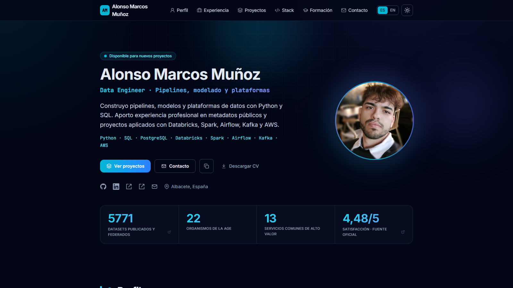

# Portfolio — Alonso Marcos Muñoz

> **Despliegue público:** [Abrir portfolio](https://alonsomarcosm.github.io)

[](https://github.com/AlonsoMarcosM/AlonsoMarcosM.github.io/actions/workflows/deploy.yml)




Personal portfolio of Alonso Marcos Muñoz, Data Engineer focused on reliable
pipelines, data modelling, data quality and operable data platforms.

🌐 **https://alonsomarcosm.github.io**

Bilingual (ES/EN with browser-language auto-detection), built with
[Astro](https://astro.build) + [Tailwind CSS](https://tailwindcss.com),
deployed automatically to GitHub Pages via GitHub Actions.

## Tech

- Astro 7 (static output, native i18n routing `/es` · `/en`)
- Tailwind CSS 4 (`@tailwindcss/vite`)
- TypeScript content model in `src/data` (bilingual)
- Light/dark theme, SEO (hreflang, JSON-LD, sitemap, OpenGraph)
- Agent-readable discovery (`/llms.txt`) and Markdown mirrors generated from the
  same typed content as the HTML pages

## Develop

```bash
npm install
npm run dev        # http://localhost:4321
npm run build      # static site -> ./dist
npm run preview    # serve the build locally
```

## Content

All content lives as typed, bilingual data in `src/data/`:

| File | Section |
| --- | --- |
| `site.ts` | profile, role, contact, social links |
| `experience.ts` | work experience |
| `projects.ts` | project case studies |
| `skills.ts` | tech stack |
| `education.ts` | education & certifications |

UI strings are in `src/i18n/ui.ts`.

Each project also declares `shields`: the same stack and version badges shown in
its repository README, rendered on the case-study page by `ShieldBadge.astro`
(CSS only, no requests to shields.io; the value text switches between black and
white to keep WCAG AA contrast on any brand colour). The footer uses the same
component for the site's own quality facts.

## Assets

- `scripts/generate-og.mjs` — regenerates the social preview cards in
  `public/img/og/` (and `public/img/og-default.png`) from the photo and the
  flagship project covers. Run with `node scripts/generate-og.mjs`.
- `scripts/optimize-assets.mjs` — renders the SVG cover diagrams to PNG and
  derives AVIF/WebP for every raster image in `public/img/projects/`.
- CVs in `public/cv/`, photo in `public/img/alonso.jpg`.

### Project covers

Every project in `projects.ts` must declare `heroImage` (a 16:9 PNG fallback
with AVIF/WebP siblings) and a bilingual `heroAlt`; `npm run test:content`
enforces both. Covers are real execution evidence wherever a useful screenshot
exists. Screenshots are cropped only (never retouched), and the originals stay
untouched in their source repositories.

| Project | Cover | Type | Source |
| --- | --- | --- | --- |
| Telco Churn MLOps | `databricks/cover-lakehouse-monitor.png` | Real screenshot | `hito4_lakehouse_monitor_dashboard.png` (Databricks dashboard), empty widget panel cropped |
| Smart Parking Albacete | `smart-parking/cover-dashboard-streamlit.png` | Real screenshot | `memoria/imagenes/captura_dashboard_streamlit.png`; the sidebar with the API Gateway URL is cropped out |
| Big Data catalogue | `spark/arquitectura-ejecutiva.svg` | Verified diagram | Redrawn from the README, `docs/visualizaciones/*.mmd`, DAGs and Spark apps of `spark-kafka-airflow-data-platform` |
| TFM OpenMetadata | `tfm-openmetadata/cover-consola-validacion.png` | Real screenshot | `TFM/Memoria/figs/fig_web_pantalla_validacion.png` |
| Data Governance · UNE | `gobierno-calidad/cover-linaje-energitech.png` | Real screenshot | `entregable/imágenes/openmetadata/om-17-lineage-completo.png` |
| AWS Honeypot | `honeypot/arquitectura-honeypot.svg` | Verified diagram | Drawn from the README and `infra/` Terraform modules of `DAMN-TEAMSSN` (EC2 Cowrie, S3, Lambda, SNS, CloudWatch, SSM) |
| TFG R scripts | `tfg-r/cover-ejecucion-r.png` | Real screenshot | TFG report figure `visualizacionMetadatosYResultados.png`, fitted to 16:9 on a dark canvas |

Diagrams are hand-written SVG (plain `<text>`, no `foreignObject`, so librsvg
renders them identically in CI) with short labels sized for a three-column card.
Each node carries its technology logo, inlined as paths from the same Iconify
sets used by the tech badges (`simple-icons` for brand logos). Where no brand
logo exists, the generic `lucide` icon used by the badges stands in: `layers`
for Delta Lake, `radio-tower` for SNS, `server-cog` for SSM and
`file-spreadsheet` for CSV. Note that `simple-icons:delta` is Delta Air Lines,
not Delta Lake.

## Deploy

Every push to `main` triggers `.github/workflows/deploy.yml`, which builds the
site and publishes `./dist` to GitHub Pages. No manual steps required.
